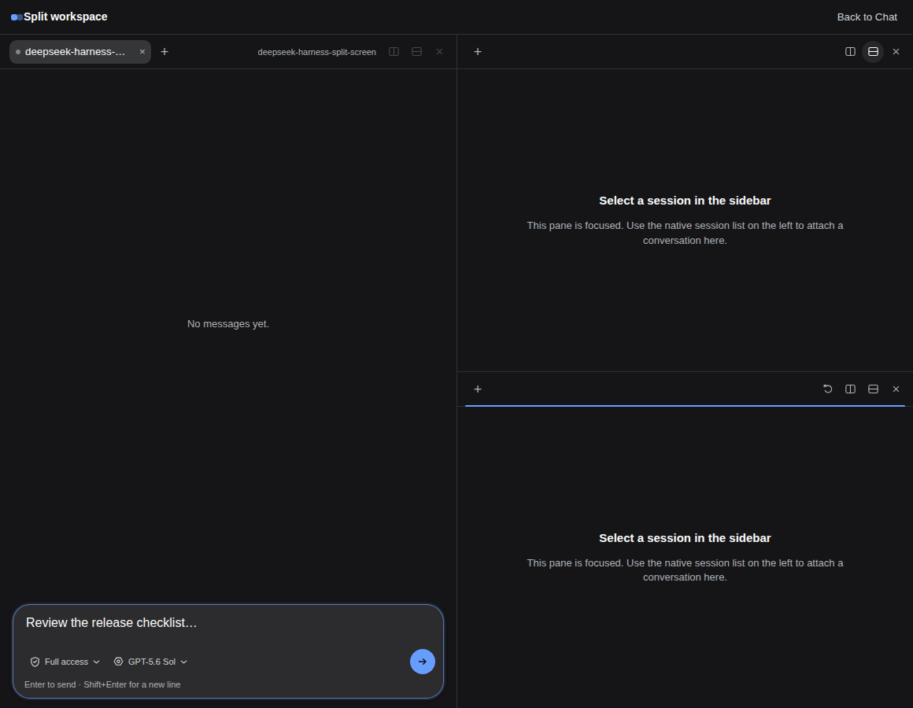

# DeepSeek Harness — Session Split Screen

An iTerm-style session multiplexer for the [DeepSeek Harness](https://github.com/deepseek-ai/deepseek-harness) Web GUI. It puts several Harness sessions on one screen and lets each pane point at a different workspace.

<p align="center">
  
</p>

## Features

- Nested **vertical** (side-by-side) and **horizontal** (stacked) splits.
- Drag any divider to resize adjacent panes.
- Drag one pane header onto another to swap their sessions.
- Up to 12 panes in one layout.
- Dedicated **Split workspace** mode in the main conversation area, toggled from the native sidebar footer.
- Pane-local chat tabs: focus a pane, then choose a session from the standard Harness session list or the pane’s `+` menu.
- Sidebar selection adds or activates a tab in the focused pane without changing another session’s native Chat view.
- Live streaming transcript, session status, queued replies, stop action, and older-history loading in every pane.
- Compact per-pane model and access-mode popup selectors with icons, including guarded **Full access** selection.
- Clickable context ring with used/remaining/limit details, plus live turn/step counts, token throughput (tok/s), input/output token totals, and cache-hit metrics.
- Structured-input indicator for approvals, plan review, and questions, with a jump to the full Harness view.
- Layout, split ratios, pane order, selected session ids, and unsent pane drafts persist in browser `localStorage`.
- English, Russian, and Chinese UI tied to the Harness locale, dark-theme token compatibility, and keyboard controls.

## Requirements

- DeepSeek Harness `0.1.0-rc.6` or compatible.
- The Web profile (`dsh web`).
- Node.js 18 or newer.

## Install

Install from npm:

```bash
dsh plugin --profile web add @syncended/dsh-split-screen
```

From this checkout during development:

```bash
dsh plugin --profile web add /absolute/path/to/deepseek-harness-split-screen
```

Some pnpm-backed profiles require the workspace-root flag:

```bash
dsh plugin --profile web add -w /absolute/path/to/deepseek-harness-split-screen
```

The package declares a DSH bundle; no manual plugin entry is required. Restart `dsh web` after installing or upgrading and refresh the existing Web GUI. A **Split** action appears in the native sidebar footer.

No environment variables, remote URL, or separate connection are required. Panes can use only sessions exposed by the same `dsh web` Host and profile.

To remove the plugin:

```bash
dsh plugin --profile web remove @syncended/dsh-split-screen
```

Restart the Host after removal.

## Usage

1. Click **Split** in the native sidebar footer. The workspace temporarily occupies the center conversation column.
2. Select a pane and use **Split vertically** or **Split horizontally** in its header.
3. With the target pane focused, choose a session in the native sidebar. It is added as a tab in that pane; selecting an already-open session focuses its existing tab.
4. Use the pane’s `+` button to add tabs without changing the sidebar selection. Closing a pane tab never deletes its Harness session.
5. Resize with the divider or drag one pane header onto another to swap complete pane tab stacks.
6. Click **Back to Chat** or the sidebar **Split** action again. Harness restores its native conversation surface on the active pane’s session.

### Keyboard shortcuts

| Shortcut | Action |
| --- | --- |
| `Alt+Shift+V` | Split the active pane vertically |
| `Alt+Shift+H` | Split the active pane horizontally |
| `Enter` | Send from the focused composer |
| `Shift+Enter` | Insert a newline |

## Workspace and persistence behavior

A single `dsh web` Host exposes all workspaces registered in that profile. The plugin can mix their sessions freely in one layout; panes do not have to share a cwd or repository.

This version does **not** aggregate sessions from separate DSH server processes or different remote URLs. Those are separate Hosts and would require a multi-connection runtime rather than a client layout plugin.

Layout and drafts are scoped to the current browser origin and profile. Use **Reset layout** to clear the saved arrangement. Clearing the site's browser storage also removes the layout and unsent pane drafts.

## Development

```bash
npm run check
npm test
npm pack --dry-run
```

The package has two runtime faces:

- `lib/index.js` — no-op Host loader entry.
- `lib/client.js` — dependency-free DSH lazy client module.

The browser half uses supported public seams:

- A dynamically registered `conversation` occupant for the center workspace; disposing it restores Harness’s shipped `ConversationRoot` unchanged.
- `sidebar.footer.action` for the persistent Split mode toggle.
- `ctx.sessions.list`, `open(id)`, `binding(id).session`, and public session projections for native selection tracking, history, streaming, prompts, permissions, token/context metrics, cancellation, and paging.
- `ctx.modelDirectories.directoryFor(id)` for the shared per-session model catalog and selection state.
- `ctx.workspaces.list` for native workspace and session labeling.

The layout is a persisted binary tree. Split nodes own direction and ratio; leaf nodes own stable pane IDs and pane-local tab stacks. Removing a leaf collapses its parent, while header drag-and-drop swaps complete pane tab stacks without rebuilding the tree.

## Current limitations

- The compact panes intentionally render conversational text and compact tool/command rows, not the full Harness card registry.
- Structured approvals, plan review, and `ask_user_question` must be completed in the normal main view; the pane provides a direct jump there.
- Skills, slash-command insertion, and the rich `+` menu intentionally stay in native Chat to keep small panes compact.
- Attachments can be represented in history, but this version sends text prompts only.
- Browser persistence is local to the current origin/profile.

## License

MIT — see [`LICENSE`](./LICENSE).
